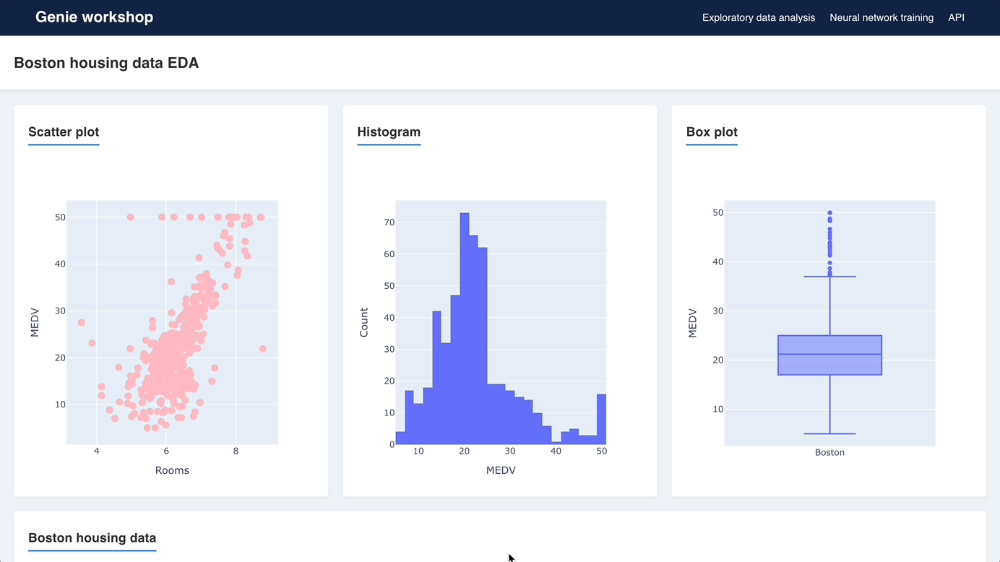

# JuliaCon 2023 Genie workshop

This workshop will teach you how to build a production-grade app with the Genie Framework. This will be a multi-page app implementing exploratory data analysis, training of a machine learning model, and serving of the model as a web API. Moreover, we'll cover containerization and deployment.




## Requirements

To follow the workshop you'll need the following:

- Template code including setup scripts, base code, and the `Project.toml` files for each app.
```bash
git clone --branch template https://github.com/BuiltWithGenie/MultiPageApp.git
```
- Julia 1.9 
- VSCode with the Genie Builder extension from the VSCode marketplace (mandatory only for no-code UI editing)
- [Slides](https://genieworkshop.netlify.app/1?print)

## Preparing for the workshop

Before the workshop starts, please make sure you have the requirements. Then, set up your environment by:

- Installing the packages that will be used by the app

```bash
./pkginstall.sh
```

- Add the apps to the Genie Builder environment
```bash
./gbsetup.sh
```

## Support

If you need any help with the setup, you can ask during the session or join the [Genie Discord](https://discord.com/invite/9zyZbD6J7H) and ask there.
